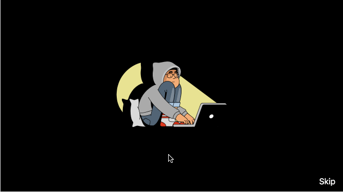

> A sticky view with scroll listener API for parallax style views.

# Stickyroll

## [Site][site] | [Getting started][getting-started]

This is the contributor documentation for the `react-stickyroll` mono-repository.
For user docs see [stickyroll.github.io/react-stickyroll](https://stickyroll.github.io/react-stickyroll)

## Intro

Stickyroll is the successor of [react-over-scroll](https://github.com/pixelass/react-over-scroll/).

## Values

Stickyroll translates page scroll to paging and a progress timeline.
The view uses `position: sticky` to remain in-view.

**Some reasons why you should give it a try**

-   Tested in all modern browsers.
-   Host multiple instances on one page.
-   Smooth transitions from docked to undocked states
-   No scroll-jacking
-   Fully Accessible
-   Allows deep links
-   Allows skipping the entire content

**Use cases**

Stickyroll offers some very unique features to build views for different use cases. Here are some basic examples.

-   fixed position Parallax views (e.g. for product landing pages)
    -   [Parallax Example](https://stickyroll.netlify.com/#!/device-support/1)  
        
-   scrollable animation scenes (e.g. using [lottie-web](https://github.com/airbnb/lottie-web))
    -   [Lottie Example](https://stickyroll.netlify.com/#!/bodymovin/1)  
        

**In the wild**

If you are using stickyroll on your web page you can add it here via a pull request or by creating an issue.

1. [Stickyroll](https://stickyroll.netlify.com/)

## Browser matrix

Stickyroll uses modern browser features and is therefore limited to these browsers. (Other browsers might work but are not being tested)

-   **Chrome**: last 2 versions
-   **Firefox**: last 2 versions
-   **Safari**: last 2 versions
-   **iOS**: last 2 versions
-   **Opera**: last 2 versions
-   **Edge**: last 2 versions

Stickyroll is tested in various environments.
With the help of [Browserstack](https://www.browserstack.com) and [Karma](https://github.com/karma-runner/karma)
tests are run on actual machines.

### Browserstack remote tests:

Thanks to the Browserstack [open source offer](<(https://www.browserstack.com/open-source)>)
we are able to test multiple browsers and platforms to ensure the best stability.

-   windows 10
    -   chrome 68.0
    -   firefox 61.0
    -   edge 17
-   os x High Sierra
    -   chrome 68.0
    -   firefox 61.0
    -   safari 11.1

## Contribute to Stickyroll

```sh
git clone https://github.com/stickyroll/react-stickyroll.git
cd react-stickyroll
yarn
yarn dev

# Test your changes
yarn test
# scpoped tests
yarn lerna run test --scope @stickyroll/<package_name>
```

## Develop guides (via patternplate)

```bash
yarn patternplate:dev
```

## License

Copyright by [Gregor Adams](mailto:greg@pixelass.com). All `@stickyroll` packages are released under the MIT license.

[site]: https://stickyroll.netlify.com/
[getting-started]: https://stickyroll.github.io/react-stickyroll/doc/guide/getting-started/Readme.html?guides-enabled=true
